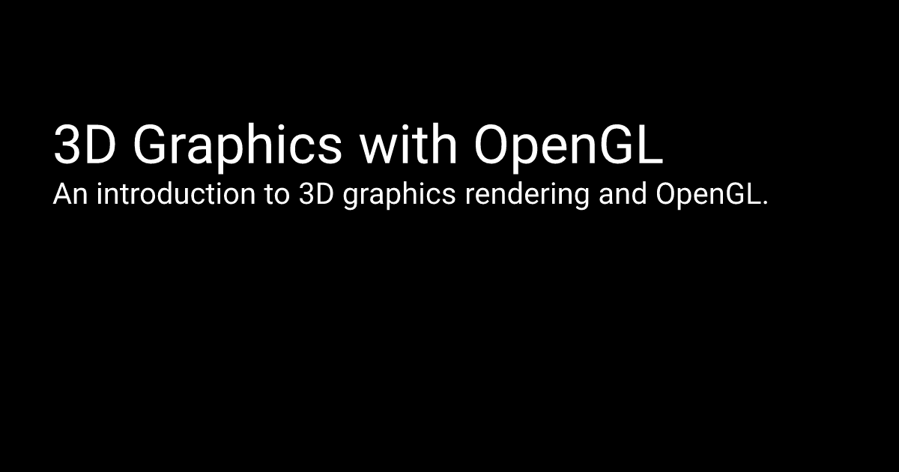
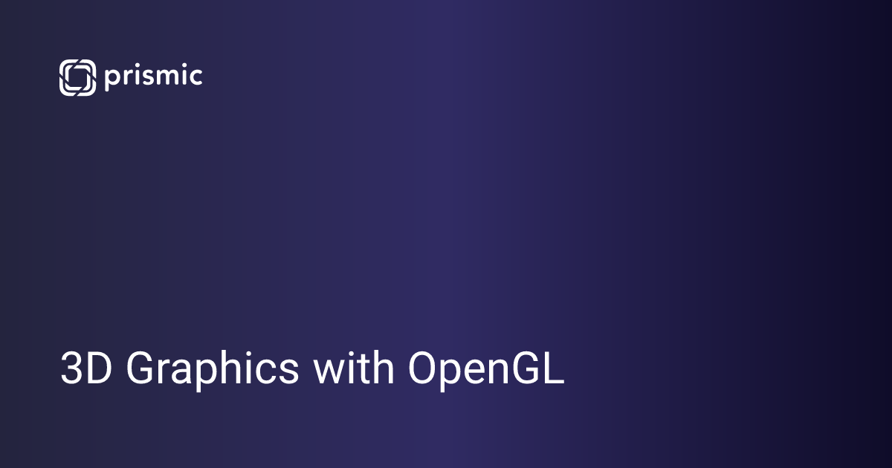
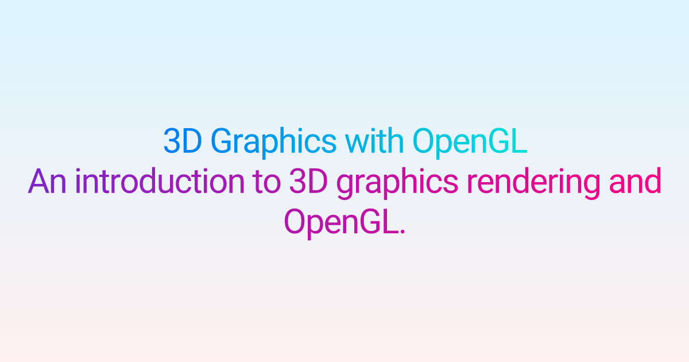
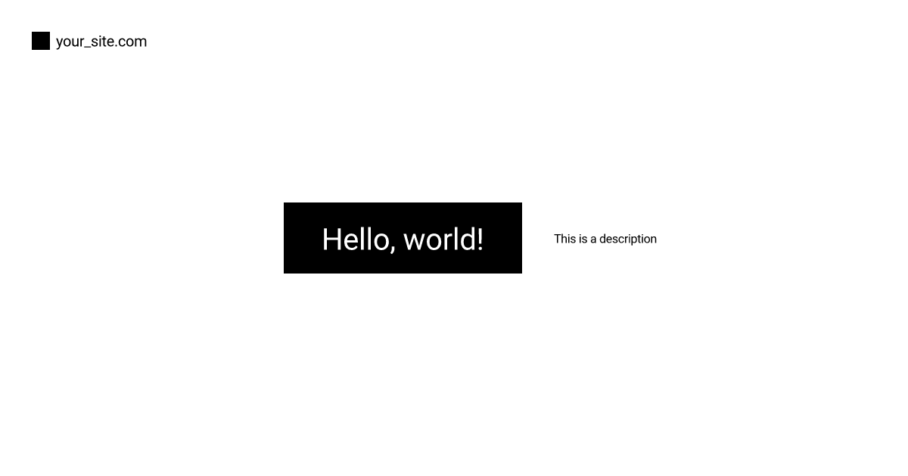
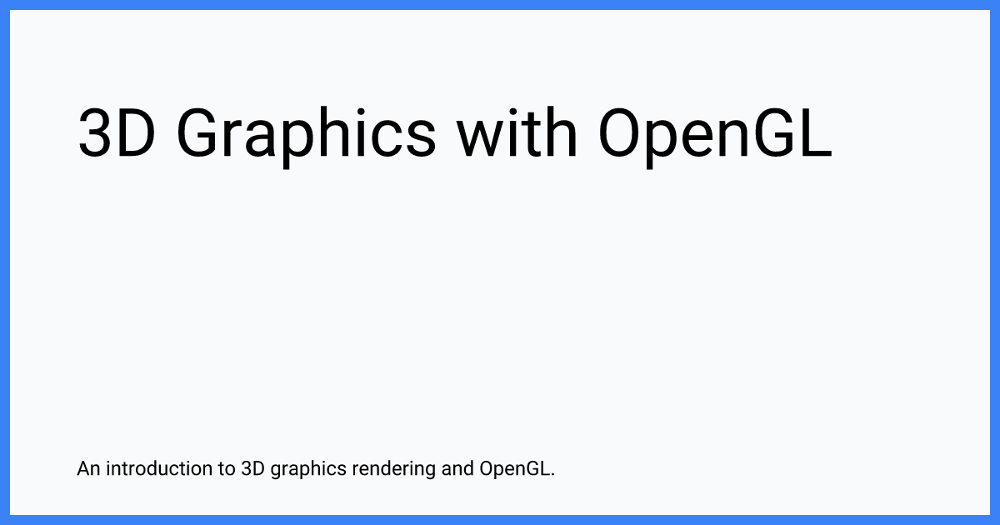
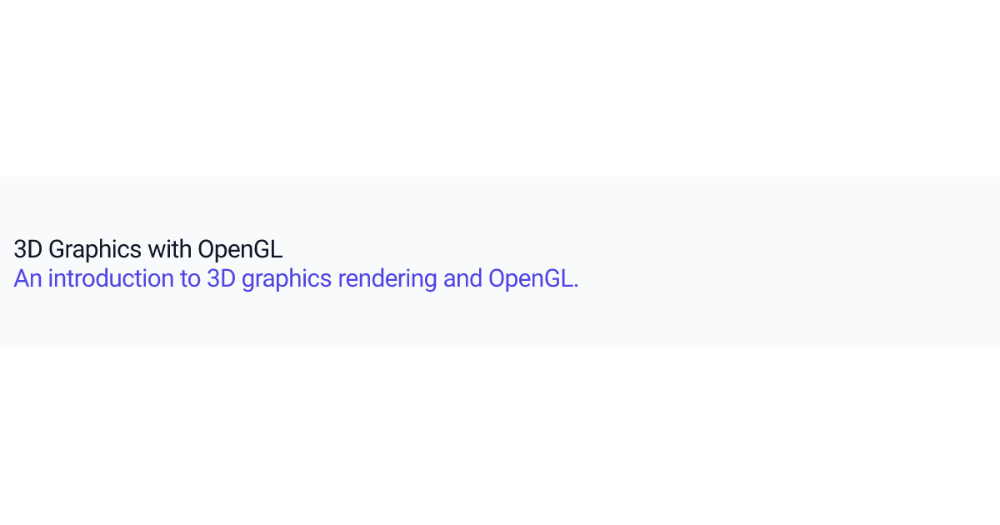
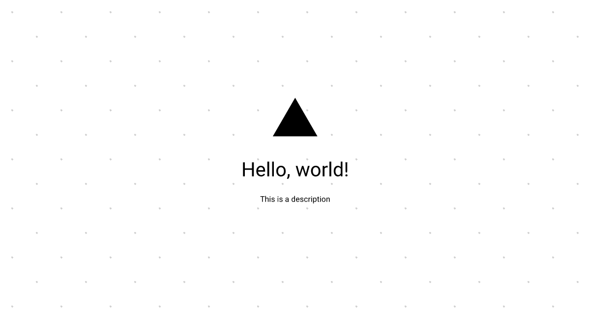

<div align="center">
  <picture>
    <source media="(prefers-color-scheme: dark)" srcset="https://cdn.rawgit.com/shepherdjerred/astro-opengraph-images/main/assets/logo-dark.png">
    <source media="(prefers-color-scheme: light)" srcset="https://cdn.rawgit.com/shepherdjerred/astro-opengraph-images/main/assets/logo-light.png">
    
  </picture>

[](https://www.npmjs.com/package/astro-opengraph-images)

Generate Open Graph images for your Astro site.

This project is actively maintained. If you have a feature request or need help, please [create an issue](https://github.com/shepherdjerred/astro-opengraph-images/issues/new).

</div>

## What is Open Graph?

[Open Graph](https://ogp.me/) is a protocol created by Facebook. It allows pages on your site to be richly embedded into other sites and applications.

You've probably seen this in action when posting a link on Facebook, Twitter, Slack, iMessage, or Discord. Links posted in supported applications will display the Open Graph metadata which often includes an image. This library will generate those images for you.

## Features

> [!WARNING]
> This integration has only been tested with statically rendered sites. It is untested with server-side rendering.

- Written in TypeScript
- Generate Open Graph images for every page on your site.
- Use a preset renderer to get started quickly.
- Images are fully customizable using [Satori](https://github.com/vercel/satori).
- Use React/JSX + Tailwind syntax or vanilla JavaScript to define your own custom images.
- Supports both static pages and Astro content collections.
- Pages can be written in Markdown, MDX, HTML, or any other format.

## Quick Start

1. Add this integration to your Astro config:

   - Option 1: use the `astro` command:

     ```bash
     npx astro add astro-opengraph-images
     ```

   - Option 2: install the package and add the integration to your Astro config:

     ```bash
     npm i astro-opengraph-images
     ```

     ```diff
     +import opengraphImages from "astro-opengraph-images";

     export default defineConfig({
       integrations: [
     +    opengraphImages()
       ],
     });
     ```

1. Install the fonts you want to use. Fonts must be explicitly declared to be used for images. System fonts are _not_ available. For this quick start guide, we'll install the [Roboto](https://fontsource.org/fonts/roboto) font:

   ```bash
   npm i @fontsource/roboto
   ```

   You can find more fonts on [Fontsource](https://fontsource.org/), or you can use any font file that you have. See [Satori's font documentation](https://github.com/vercel/satori?tab=readme-ov-file#fonts) for more information.

1. Configure the integration in your Astro config:

   ```diff
   -import opengraphImages from "astro-opengraph-images";
   +import opengraphImages, { presets } from "astro-opengraph-images";

   export default defineConfig({
     integrations: [
   -    opengraphImages()
   +    opengraphImages({
   +      options: {
   +        fonts: [
   +          {
   +            name: "Roboto",
   +            weight: 400,
   +            style: "normal",
   +            data: fs.readFileSync("node_modules/@fontsource/roboto/files/roboto-latin-400-normal.woff"),
   +          },
   +        ],
   +      },
   +      render: presets.blackAndWhite,
   +    }),
     ],
   });
   ```

1. Update your Astro layout to add the appropriate `meta` tags. The [OpenGraph site](https://ogp.me/) has more information about valid tags.

   The following `meta` tags must be defined:

   - `og:title`
     - This field may be used when generating images.
   - `og:type`
     - See the [Open Graph documentation](https://ogp.me/#types) for valid values.
   - `og:image`
     - Set this to the return value of `getImagePath` (example shown below).
   - `og:description`
     - Optional. This field may be used when generating images.

   Your site will fail to build if the tags above are not set. Additionally, if the value of `og:image` does not match what this integration expects, the site will fail to build. This is to ensure your site is correctly configured to display Open Graph images.

   Make sure the [`site`](https://docs.astro.build/en/reference/configuration-reference/#site) property is configured in your Astro config:

   ```diff
   export default defineConfig({
   +  site: "https://<your site>.com",
   });
   ```

   This integration will not work without it.

   Install the [`astro-seo`](https://github.com/jonasmerlin/astro-seo) package to make this a bit easier:

   ```bash
   npm i astro-seo
   ```

   Update your Astro layout:

   ```diff
   ---
   + import { SEO } from "astro-seo";

   interface Props {
     title: string;
   }

   const { title } = Astro.props;
   +const { url, site } = Astro;
   +const openGraphImageUrl = getImagePath({ url, site });
   ---

   <!doctype html>
   <html lang="en">
     <head>
       <meta charset="UTF-8" />
       <meta name="description" content="Astro description" />
       <meta name="viewport" content="width=device-width" />
       <link rel="icon" type="image/svg+xml" href="/favicon.svg" />
       <meta name="generator" content={Astro.generator} />
       <title>{title}</title>

   +    <SEO
   +      openGraph={
   +        {
   +          basic: {
   +            title: title,
   +            type: "website",
   +            image: openGraphImageUrl,
   +            url: url,
   +          },
   +          optional: {
   +            description: "My page description",
   +          },
   +        }
   +      }
   +    />
     </head>
     <body>
       <slot />
     </body>
   </html>
   ```

1. Build your site. You should see a `.png` file next to each `.html` page in your `dist` folder. Double-check that the `og:image` proprety in your `.html` file matches the path to the `.png` file.

1. Deploy your site. You can verify that your images are correct by:

   - Sending a link to your site in an application that supports Open Graph like iMessage, Slack, Discord, etc.
   - Visit [opengraph.xyz](http://opengraph.xyz/) and test your site.

## Examples

There is an example site using this integration under [`example/`](https://github.com/shepherdjerred/astro-opengraph-images/tree/main/example).

### Sites Using This

If you're using this project, [open a PR](https://github.com/shepherdjerred/astro-opengraph-images/compare) to add your site to this list.

- [sjer.red](https://sjer.red) ([source](https://github.com/shepherdjerred/sjer.red))

## Custom Renderers

You can create your own custom images with a render function. Take a look at how [a preset](https://github.com/shepherdjerred/astro-opengraph-images/blob/main/src/presets/blackAndWhite.tsx) works.

This library uses [Satori](https://github.com/vercel/satori) to convert React components to SVG. The SVG is then converted to a PNG using [resvg-js](https://github.com/yisibl/resvg-js).

> [!TIP]
> Satori supports [a subset of CSS](https://github.com/vercel/satori?tab=readme-ov-file#css). Be sure to familiarize yourself with its limitations.
>
> You can use the [Satori playground](https://og-playground.vercel.app/) to work on your images.
>
> You can use Tailwind syntax with [tw-to-css](https://github.com/vinicoder/tw-to-css). An example is the [Tailwind preset](https://github.com/shepherdjerred/astro-opengraph-images/blob/main/src/presets/tailwind.tsx). You'll need to install this package yourself.

## Presets

Presets are located in [`src/presets/`](https://github.com/shepherdjerred/astro-opengraph-images/tree/main/src/presets). [Open a pull request](https://github.com/shepherdjerred/astro-opengraph-images/compare) to contribute a preset you've created.

Note: some presets use the [`tw-to-css`](https://github.com/vinicoder/tw-to-css) library. You'll need to install this dependency separately when using one of these presets. You'll see an error if the library is not already installed.

```bash
npm i tw-to-css
```

### `backgroundImage`

```diff
import opengraphImages, { presets } from "astro-opengraph-images";

export default defineConfig({
  integrations: [
    opengraphImages({
+      render: presets.backgroundImage,
    }),
  ],
});
```


### `blackAndWhite`

```diff
import opengraphImages, { presets } from "astro-opengraph-images";

export default defineConfig({
  integrations: [
    opengraphImages({
+      render: presets.blackAndWhite,
    }),
  ],
});
```



### `brandedLogo`

```diff
import opengraphImages, { presets } from "astro-opengraph-images";

export default defineConfig({
  integrations: [
    opengraphImages({
+      render: presets.brandedLogo,
    }),
  ],
});
```



### `gradients`

```diff
import opengraphImages, { presets } from "astro-opengraph-images";

export default defineConfig({
  integrations: [
    opengraphImages({
+      render: presets.gradients,
    }),
  ],
});
```



### `podcast`

```diff
import opengraphImages, { presets } from "astro-opengraph-images";

export default defineConfig({
  integrations: [
    opengraphImages({
+      render: presets.podcast,
    }),
  ],
});
```


### `rauchg`

```diff
import opengraphImages, { presets } from "astro-opengraph-images";

export default defineConfig({
  integrations: [
    opengraphImages({
+      render: presets.rauchg,
    }),
  ],
});
```



### `simpleBlog`

```diff
import opengraphImages, { presets } from "astro-opengraph-images";

export default defineConfig({
  integrations: [
    opengraphImages({
+      render: presets.simpleBlog,
    }),
  ],
});
```



### `tailwind`

```diff
import opengraphImages, { presets } from "astro-opengraph-images";

export default defineConfig({
  integrations: [
    opengraphImages({
+      render: presets.tailwind,
    }),
  ],
});
```



### `vercel`

```diff
import opengraphImages, { presets } from "astro-opengraph-images";

export default defineConfig({
  integrations: [
    opengraphImages({
+      render: presets.vercel,
    }),
  ],
});
```



### `waveSvg`

```diff
import opengraphImages, { presets } from "astro-opengraph-images";

export default defineConfig({
  integrations: [
    opengraphImages({
+      render: presets.waveSvg,
    }),
  ],
});
```


## Alternatives

Here are some similar libraries using Satori and Astro. I haven't done a feature comparison.

- https://github.com/florian-lefebvre/satori-astro (This library looks excellent)
- https://github.com/delucis/astro-og-canvas (Doesn't allow arbitrary layouts)
- https://github.com/thewebforge/astro-og-images (Only allows you to choose from a list of templates)
- https://github.com/tomaskebrle/astro-og-image (Seems limited)
- https://github.com/cijiugechu/astro-satori (Possibly dead, hasn't been updated in a year)
- https://github.com/kevinzunigacuellar/astro-satori (Possibly dead, hasn't been updated in a year)
- https://github.com/rumaan/astro-vercel-og (Possibly dead, hasn't been updated in a year)
